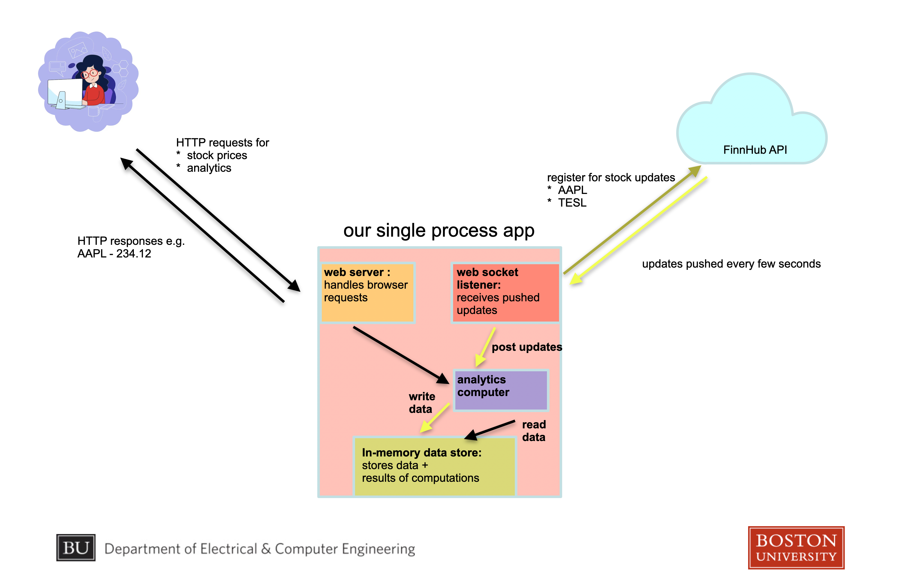

# StockApp

A high level overview of the StockApp application is below:

It consists of the following components:

## WebSocket Listener - Finhub API

The data input to StockApp is the [Finhub API](https://finnhub.io/).  More specifically, StockApp supports [WebSocket](https://ably.com/topic/websockets) subscriptions for price & trade volume updates for a set of stock symbols.  These updates are the core source of data for StockApp.

## Analytics Computor

The responsibility of the analytics computor is to take the data that StockApp has received from Finhub and based on this data expose meaningful, actionable information back to StockApps's end users.  For example, the analytics computor is responsible for computing the numeric responses to questions like:

* what is the current price of <symbol>?
* of the symbols being tracked, which one has experienced the highest price fluctuation over the last 3 hours?

## In-memory data store

StockApp will receive data from Finhub continuously.  StockApp's end users will ask questions about the data at unpredictable intervals.  Some representation of the data received from Finhub must be stores somewhere to facilitate this, and this is the current implementation of that storage.

## Web Server

StockApp's web server responsed to customer requests via HTTP.  Some of the supported endpoints are:
* `/symbols` - returns the list of stock symbols that have been seen by the server.
* `/price/<symbol>` - returns the most recent price update for the given stock symbol.
* `/mostactive` - returns the stock for which the server has seen the highest total trade volume.

For example:
* `curl "http://localhost:8000/symbols"` might return `BAC,RIVN,NKE`
* `curl "http://localhost:8000/price/BAC"` might return `43.1`
* `curl "http://localhost:8000/mostactive"` might return `NKE`

## Building and Running
StockApp is built with [gradle](https://gradle.org/) and gradle specifics are configured in `build.gradle` at the root of the repository.

## Logging
This project uses the lightweight [TinyLog](https://tinylog.org/v2/) framework for logging.  The configuration can be found at [src/main/resources/tinylog.properties](src/main/resources/tinylog.properties).

### Common Gradle targets
Some useful gradle tasks for the project are:

* **gradle clean build** - perform a clean build (the build cache is thrown out at the start of the build).  This includes  compilation, test execution, and static analysis.  If this succeeds, your project is in a good state.
* **gradle test** - execute the test suite.
* **gradle spotlessApply** - reformat any file in the project that does not conform to our consistent format standard.
* **gradle preCommit** - cleans, applies spotless, and builds.  Generally a great idea to run this before committing code to make sure everything is in a good state.
* **gradle runServer** - run the StockApp server - includes all of the components described above and StockApp will query FinHub for stock updates.
* **gradle runServerWithMockFinhub** - run the StockApp server.  Instead of querying the "real" FinHub API, a mock FinHub client is used to provide canned stock updates.  This is useful for running locally when querying a real, unpredictable endpoint is not desired.  The canned responses are deterministic and consistent and good for testing changes iteratively.
* **./serviceTest.sh** - this script starts the StockApp server using the MockFinHub client and executes a suite of service tests against the running server.

## MockFinHubClient
As mentioned above, the MockFinHubClient is useful for executing the StockApp with predictable, deterministic, and configurable canned responses instead of the real WebSocket updates from FinHub.  This mock client can be executed in a few different modes:

* **default** - by default it will emit a canned stock update response every 5 seconds.
* **msBetweenCalls** - passing a JAva runtime argument of the form, `msBetweenCalls=10`, will cause the mock client to emit updates more frequently, in this example one every 10 milliseconds.  This is useful for putting the StockApp server into a predictable state against which assertions can be made without the server state changing due to it receiving more updates.  Setting the value to a low number, like 10 ms, causes an initial burst of canned updates followed by no updates.  

# Git & GitHub Resources

## Git
- [Git site](https://git-scm.com/)
- [Git tutorial](https://git-scm.com/docs/gittutorial)
- [Git for computer Scientists](https://eagain.net/articles/git-for-computer-scientists/)

## GitHub

## GUI Clients
- [GitHub Desktop](https://github.com/apps/desktop)
- [SourceTree](https://www.sourcetreeapp.com/)
